# Quarto Projeto - Burger Queen (API Client)

## Índice

- [1. Introdução](#1-Introdução)
- [2. Resumo do Projeto](#2-Resumo-do-projeto)
- [3. Futuro do Projeto](#3-Futuro-do-Projeto)
- [4. Proto Personas](#4-PROTO-PERSONAS)
- [5.Pesquisa de usuários](#5-Pesquisa-de-usuários)
- [6.Histórias de usuário](#6-histórias-de-usuário)
- [7.Fluxogramas](#7-Fluxogramas)
- [8.Design](#8-Design)
- [9. Demonstrações da Aplicação Web](#9-Demonstrações-da-Aplicação-Web)
- [10. Tecnologias e Ferramentas Utilizadas ](#10-Tecnologias-e-Ferramentas-Utilizadas)
- [11. Desenvolvedoras](#11-desenvolvedoras)

## 1. Introdução

<h2>Burger Heroes</h2>

Quarto projeto desenvolvido no bootcamp de front-end da Laboratoria. Neste projeto desenvolvemos uma aplicação web na modalidade _mobile first_ (_tablet_) para aprimorar e agilizar o atendimento de uma hamburgueria. Através desta aplicação é possível que os funcionários do setor de atendimento e cozinha gerenciem os pedidos de seus clientes.

---
## 2. Resumo do projeto

A Burger Heroes sabe o quanto salvar o mundo é importante, sendo assim, fornece aos seus clientes, atendimento e cozinha uma forma rápida e fácil de realizar pedidos, gerenciá-los e prepará-los.
Para a Burger Heroes os heróis são os próprios clientes. Ela utiliza produtos e utensílios que não agridem o meio ambiente, é uma verdadeira empresa _eco-friendly_. Apesar de adotar uma referencia aos heróis da Marvel e DC, acredita que qualquer pessoa que opte por utilizar produtos _eco friendly_ são os verdadeiros heróis do planeta. 
A Burger Heroes é uma empresa fictícia mas que a grande maioria da população já almeja para o futuro onde empreender também significa cuidar do meio ambiente. 
Por meio desta aplicação web é possível que o atendimento adicione pedidos a mesa do cliente, inserindo o numero e o nome da pessoa que está atendendo e assim, envia-los para a cozinha.
A cozinha recebe o pedido enviado pelo atendimento para inciar seu preparo e, logo que o pedido estiver pronto, envia-lo de volta ao atendimento para que seja realizada a entrega.
Na aplicação haverá uma aba de histórico de pedidos onde os mesmos permanecerão sendo exibidos, mesmo que finalizados, ainda portando o ID, duração do preparo e entrega.

Clique [aqui](https://natalieiss.github.io/Terceiro-Projeto-Social-Network) para converir o resultado da aplicação. 

Se preferir não se cadastrar nesta aplicação web, será possível realizar o _login_ através dos _e-mails_ e senhas previamente cadastrados:

Para acessar o atendimento - Email: atendimento@burgerheroes.com Senha: 123456

Para acessar cozinha - Email: cozinha@burgerheroes.com Senha: 123456

---
## 3. Futuro do Projeto

Para as próximas implementações (v2.0) iremos melhorar a segurança de nossos usuários acrescentando uma Política de Privacidade e Cookies bem como um termo de usuário para melhor atender ao disposto na Lei Geral de Proteção de Dados Pessoais (LGPD). 
Pensando em um modelo futurista será criado um ambiente exclusivo para cadastro, _login_ e senha do próprio cliente. Desta forma, será possível que o cliente escolha se quer realizar o seu proprio atendimento.
Esta projeto também será refatorado. Será aprimorada a responsividade para os tablets e iremos acrescenta-la para celulares. Serão implementadas melhorias na estilização através do CSS.
Também serão implementados novos testes assíncronos e unitários.
Acrescentaremos também novos recursos para melhorar a acessibilidade na aplicação.

---

## 4. PROTO PERSONAS
## Criamos as proto personas da nossa aplicação:

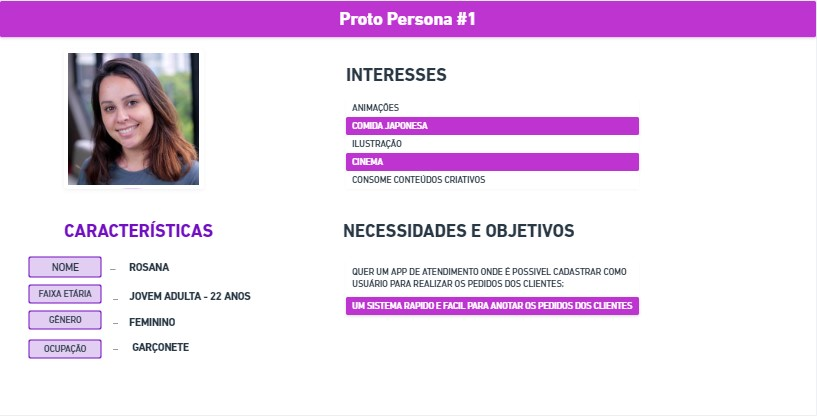

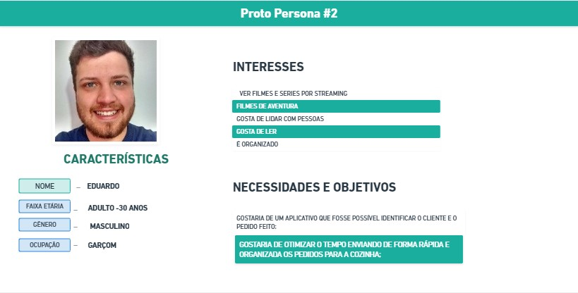

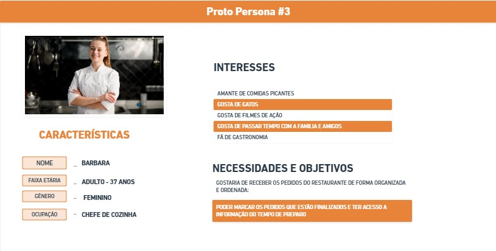

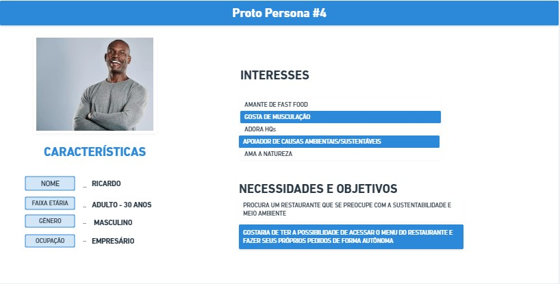

---

## 5. PESQUISA DE USUÁRIOS
## Realizamos uma [pesquisa](https://forms.gle/S95Z9Ug8s7HbAwJGA) para validarmos as proto personas. A pesquisa obteve a participação de 8 pessoas que forneceu os seguintes resultados:

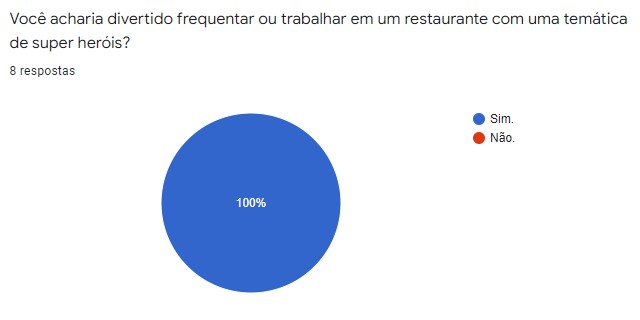

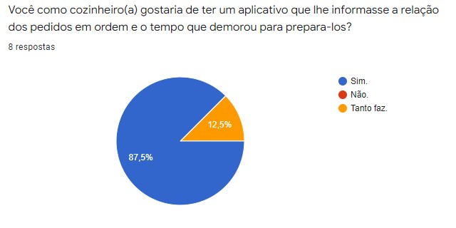

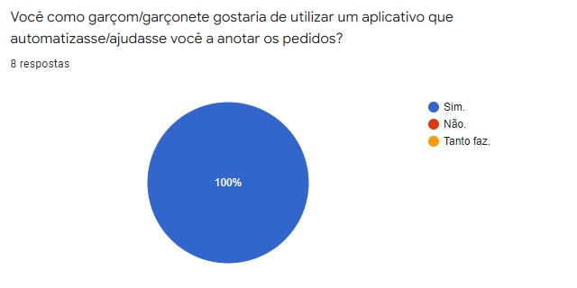

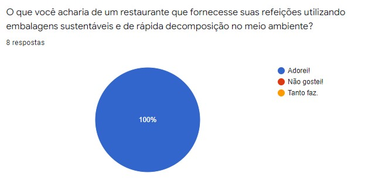

---

## 6. HISTORIAS DE USUÁRIO

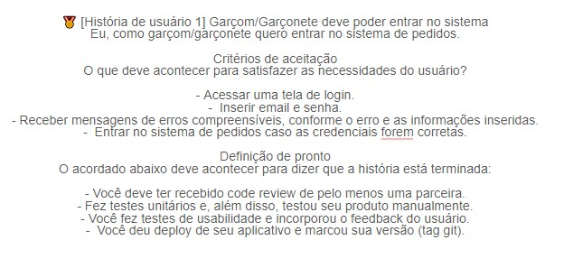

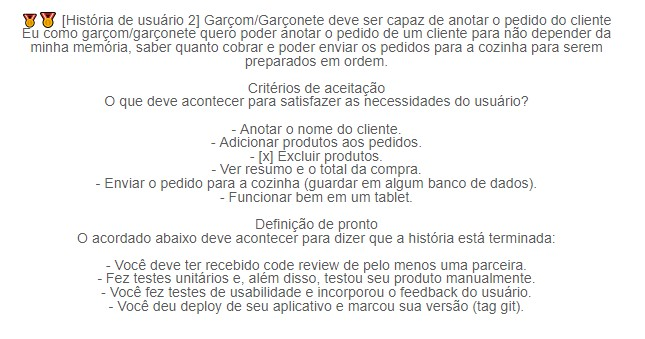

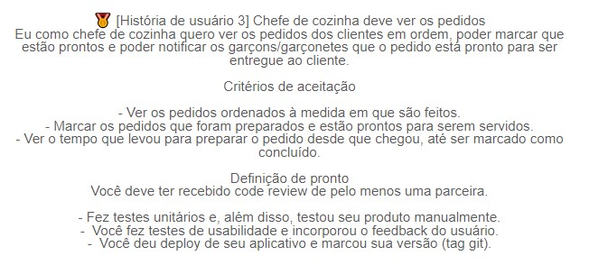

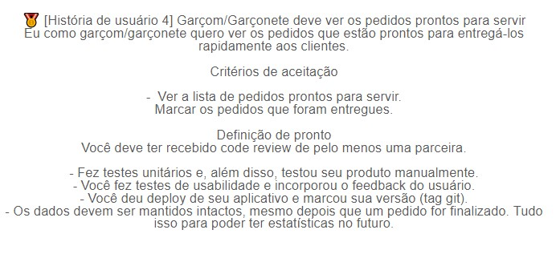

---

## 7. FLUXOGRAMAS
## Com base nas historias de usuário nós criamos os fluxogramas para cada uma delas.

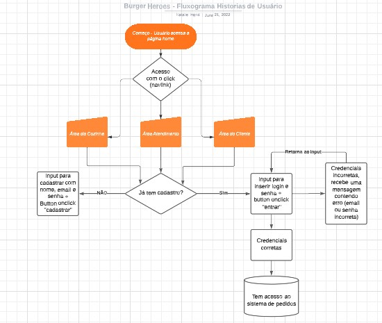

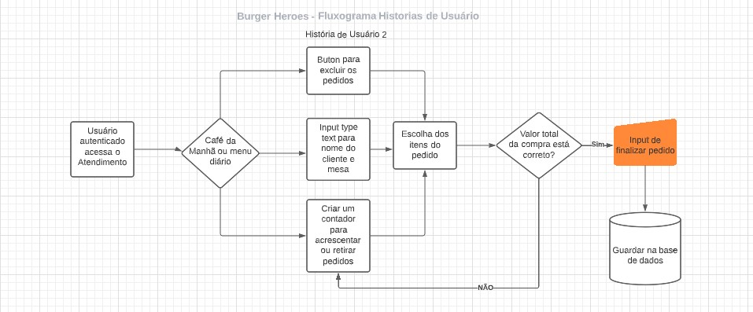

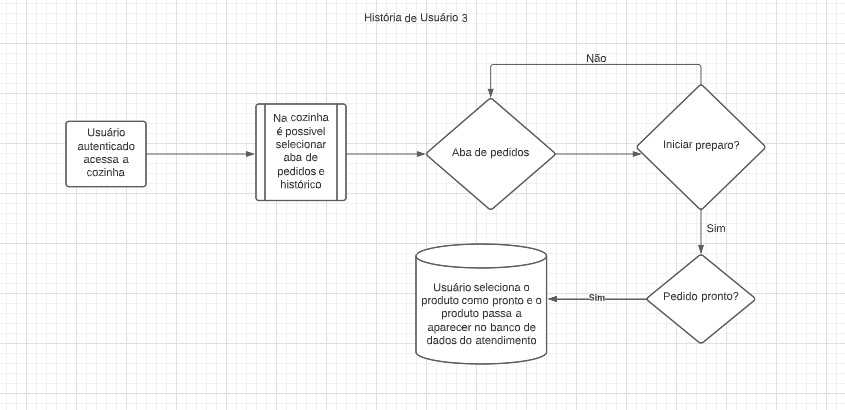

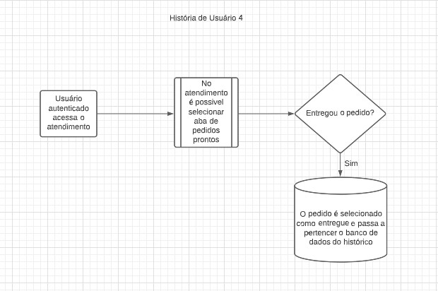

---
## 8. PROTÓTIPO E TESTES DE USABILIDADE

## Visualizamos uma aplicação que refletisse as cores marcantes dos super heróis dos quadrinhos e escolhemos a fonte que remetesse as utilizadas nos HQ's para tornar a experiência mais divertida.

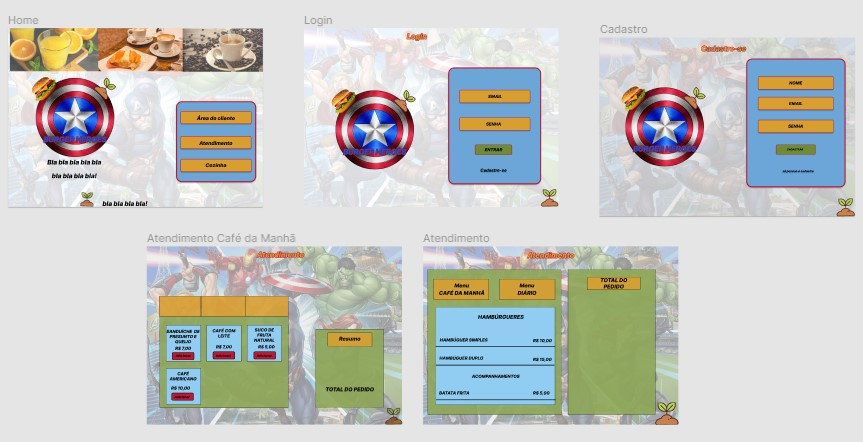
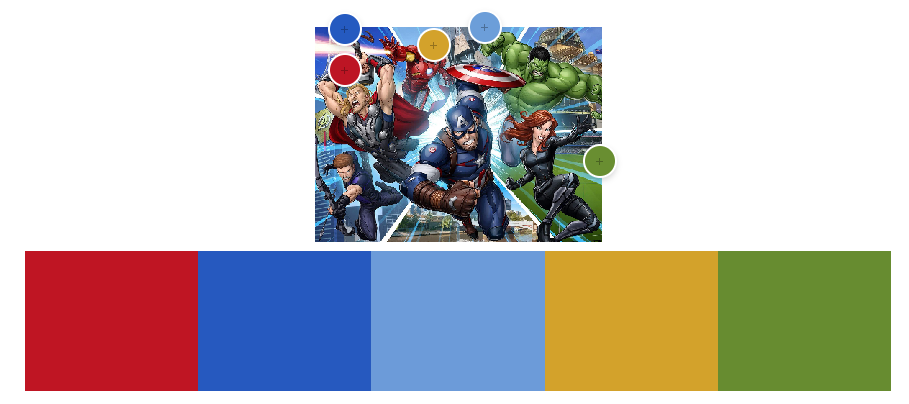

## Com o auxílio do figma também criamos um protótipo interativo para ser utilizado nos testes iniciais de usabilidade.

  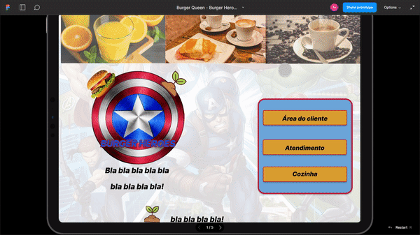

---
## 9. DEMONSTRAÇÕES DA APLICAÇÃO WEB

Versão Web

  
  
  

Versão Tablet

  
  

---
## 10. TECNOLOGIAS E FERRAMENTAS UTILIZADAS

- **Planejamento: [Trello](https://trello.com/b/teBSp1E8/burger-queen-burger-heroes)**
- **Protótipos: [Figma](https://www.figma.com/file/6xnHbLDVtOnINJdLrRTRpE/Burger-Queen---Burger-Heroes?node-id=0%3A1)**
- **HTML5** 
- **CSS3**     
- **JavaScript**     
- **React** 
- **JSX** 
- **Node JS**      
- **Heroku** 
- **Jest** 
- **Git** 
- **GitHub** & **GitHubProjects** 
- **Visual Studio Code** 
- **API** 

---
## 11. DESENVOLVEDORAS DO PROJETO

<table>
 <td align="center">
      <a href="https://github.com/Fe-Monteiro">
   
             
          <b>Fernanda Monteiro</b>
        
      </a>
    </td>
  </tr>
 <tr>
    <td align="center">
      <a href="https://github.com/natalieiss">
           
  
          <b>Natalie Silva</b>
        
      </a>
    </td>
</table>

---
