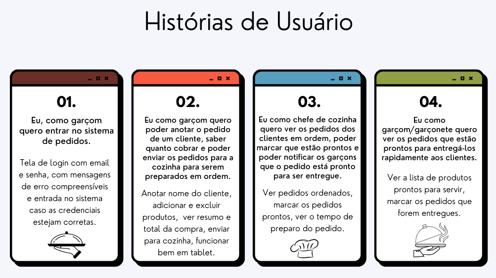
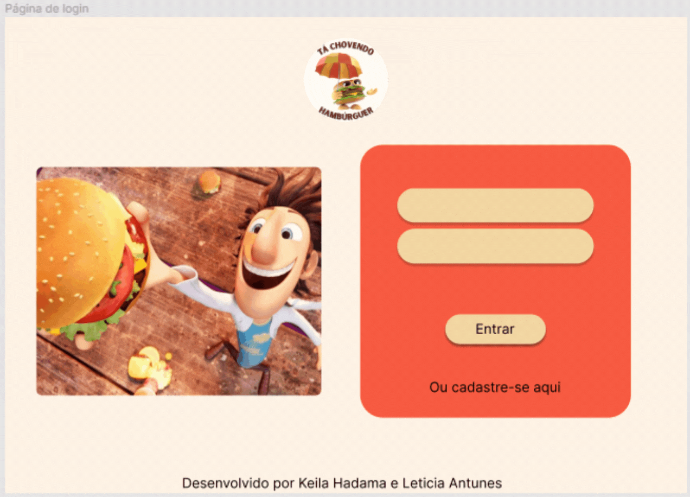

# Tá Chovendo Hambúrguer 🍔☔

# Índice

- [1. Resumo do projeto](#1-Resumo-do-Projeto-pushpin)
- [2. Histórias de usuário](#2-Histórias-de-Usuário-woman-man)
- [3. Protótipo, Paleta de Cores e Tema](#3-Protótipo-Paleta-de-Cores-e-Tema-art)
- [4. Testes de Usabilidade](#4-Testes-de-Usabilidade-busts_in_silhouette)
- [5. Aplicação em Funcionamento](#5-Aplicação-em-Funcionamento-computer)
- [6. Tecnologias Utilizadas](#6-Tecnologias-utilizadas-octocat)
- [7. Autoras](#7-Autoras-woman_technologist-woman_technologist)

---

 

Aplicativo web voltado para gerenciamento interno de pedidos e comandas do restaurante Tá Chovendo Hambúrguer. O usuário pode realizar ações como atendente anotando pedidos, mandando para preparo e servindo os pedidos prontos da cozinha ou como cozinheiro vizualizando pedidos a serem feitos, preparando e atualizando o status dos pedidos.

🔗 [Link da aplicação](https://sap-007-burger-queen-api-client.vercel.app/) 🔗

Credenciais de acesso:

|     | Atendimento         | Cozinha         |
| --- | ------------------- | --------------- |
| 📨  | atendimento@tch.com | cozinha@tch.com |
| 🔐  | 123456              | 123456          |

  

---

# 1. Resumo do Projeto :pushpin:

Um restaurante de hambúrgueres necessita uma
interface em que se possa realizar pedidos utilizando um _tablet_, e enviá-los
para a cozinha para que sejam preparados de forma ordenada e eficiente.

Este projeto tem duas áreas: interface (cliente) e API (servidor). Nosso
cliente nos pediu para desenvolver uma interface que se integre com a API.

A interface deve mostrar os dois menus (café da manhã e restante do dia), cada
um com todos os seus _produtos_. O usuário deve poder escolher que _produtos_
adicionar e a interface deve mostrar o _resumo do pedido_ com o custo total.

Além disso a cliente nos deu uma documentação com o comportamento 
esperado da API que iremos expor por HTTP. 
Lá podemos encontrar todos os detalhes dos _endpoints_.

O objetivo principal é aprender a construir uma _interface web_ usando o
_framework_ React. Esses framework resolve
o problema de **como manter a interface e estado sincronizados** utilizando o conceito de _estado da
tela_, e como cada mudança no estado vai refletir na interface.

O projeto foi realizado em 6 sprints utilizando as metodologias ágeis SCRUM e KANBAN, por meio da plataforma [Trello](https://trello.com/b/oGsYEhKx).

---

# 2. Histórias de Usuário :woman: :man:

---

# 3. Protótipo, Paleta de Cores e Tema :art:

O protótipo, disponível [neste link](https://www.figma.com/file/1lObcDyrzTJ3JQwJ3BXkdf/Burguer-Queen?node-id=0%3A1), foi desenvolvido pensando em conceitos importantes para aplicações web como tipografia, hierarquia e contraste.

O tema e a paleta de cores foram inpirados no filme Tá Chovendo Hambúrguer, de 2009, em que o personagem principal cria uma máquina que transforma água em comida e de repente começa a chover hambúrgueres em toda a cidade.

---

# 4. Testes de Usabilidade :busts_in_silhouette:

Durante o desenvolvimento do projeto, foram realizados testes de usabilidade com usuários no intuito de analisar a experiência do usuário com a aplicação. Com base nos feedbacks dos testes, foram implementadas as seguintes soluções:

- Hover nos botões de excluir produto e de sair;
- Mensagem de sucesso após o garçom realizar o pedido;
- Indicação das páginas login e cadastro no formulário;

---

# 5. Aplicação em Funcionamento :computer:

---

# 6. Tecnologias utilizadas :octocat:

---

# 7. Autoras :woman_technologist: :woman_technologist:

# Keila Hadama

- [LinkedIn](https://www.linkedin.com/in/keila-hadama/)
- E-mail: hadamakeila@gmail.com

# Leticia Antunes

- [LinkedIn](https://www.linkedin.com/in/leticiaantunes95/)
- E-mail: leticiaantunes95@outlook.com

---

## Obrigada pela visita, volte sempre! :grinning:

