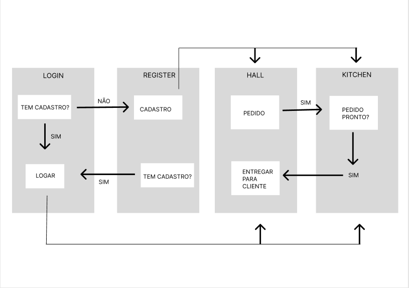
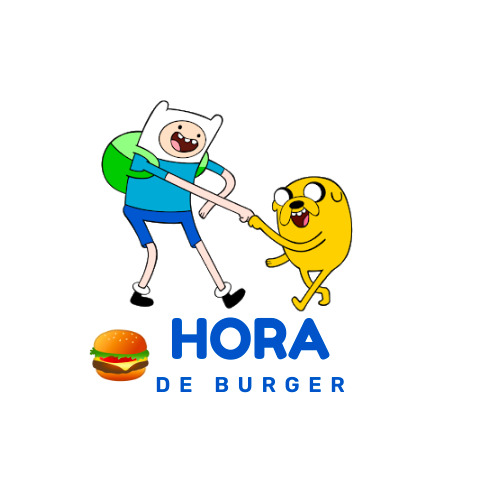
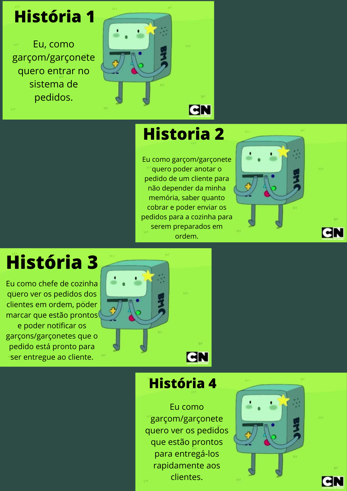

# Burger Queen (API Client)

# HORA DE BURGER

## Índice

* [1. Resumo do projeto](#1-resumo-do-projeto)
* [2. Definição do Produto](#2-definição-do-projeto)
* [3. Planejamento e Organização](#3-planejamento-e-organização)
* [4. Histórias de Usuário](#4-histórias-de-usuário)
* [5. Teste de Usabilidade](#5-teste-de-usabilidade)
* [6. Tecnologias Utilizadas](#6-tecnologias-utilizadas)
* [7. Considerações](#7-considerações)

***

## 1. Resumo do Projeto

Um pequeno restaurante de hambúrgueres, que está crescendo, necessita uma
interface em que se possa realizar pedidos utilizando um _tablet_, e enviá-los
para a cozinha para que sejam preparados de forma ordenada e eficiente.

Este projeto tem duas áreas: interface (cliente) e API (servidor). Nosso
cliente nos pediu para desenvolver uma interface que se integre com a API.

A interface deve mostrar os dois menus (café da manhã e restante do dia), cada
um com todos os seus _produtos_. O usuário deve poder escolher que _produtos_
adicionar e a interface deve mostrar o _resumo do pedido_ com o custo total.

Foi construido uma _interface web_ usando o
_framework_ React. Esses framework front-end ataca
o seguinte problema: **como manter a interface e estado sincronizados**.

## 2. Definição do Produto

Sistema de comanda de pedidos para acesso de garçon/garçonete e chef de cozinha para uma hamburgueria de atentimento 24hs.Com temática baseada no desenho _Adventure Time_ (Hora da Aventura), além de funcional o produto  atende a identidade visual do cliente.
A aplicação é uma SPA (Single Page Aplication) e atende diversos tamanhos de tela.

## 3. Planejamento e Organização

O planejamento foi acompanhado pela ferramenta _Projects_ do _GitHub_.Com a metodologia ágil _Kanban_ alinhados com os commits realizados em cada _task_ para conclusão das histórias de usuário.

#### Protótipos

Realizado na ferramenta [ _Figma_ ](https://www.figma.com/files/project/59452390/Team-project?fuid=1063884082921018774), foi desenhado pensando no fluxo da rotina de trabalho da hamburgueria, conforme fluxograma abaixo:

A paleta de cores escolhida foi de acordo com a logo do resturante, que consta os dois personagens principais do desenho: Finn e Jake.

#### A paleta de cores:

#### Logo da Hamburgueria:

## 4. Histórias de Usuário

#### Definição de pronto

O acordado abaixo deve acontecer para dizer que a história está terminada:

* Você deve ter recebido _code review_ de pelo menos uma parceira.
* Fez _testes_ unitários e, além disso, testou seu produto manualmente.
* Você fez _testes_ de usabilidade e incorporou o _feedback_ do usuário.
* Você deu deploy de seu aplicativo e marcou sua versão (tag git).
* Os dados devem ser mantidos intactos, mesmo depois que um pedido for
  finalizado. Tudo isso para poder ter estatísticas no futuro.

***

## 5.  Teste de Usabilidade

Foi realizado teste de usabilidade ao final de cada história do usuário.

#### História 1

Matheus Souza
* _Layout_ do botão ENTRAR pequeno
Solução: Aumentamos o tamanho do botão e seu padding para aumentar a àrea de clique e adicionamos um cursor pointer.

#### História 2

Thiago Capelo
* Não consegiu cadastrar senha com caracter especial e a quantidade tinha que ser exatamente 6
Solução: Adicionamos no padrão que a senha deveria ter no mínimo seis caracteres e incluimos caracteres especiais.
* Não sabia se o cadastro tinha sido efetuado
Solução: Implementamos uma mensagem de sucesso após conclusão do cadastro.

#### História 3

Leticia Antunes
* Imagem pequena no cabeçalho da página da cozinha, na tela desktop.
Solução: Aumentamos a imagem
* Card dos pedidos estavam muito juntos
Solução: Colocamos border-radius e espaçamos os cards

#### História 4

Julia Benedicto

## 6. Tecnologias Utilizadas

- HTML 
- CSS (module)
- JSX
- Node JS
- Git
- GitHub
- Netlify
- Jest
- React
- API
- Figma
- Slack

## 7. Considerações

Projeto realizado pelas desenvolvedoras Marione Pereira e Thaís Bonalume, no bootcamp Laboratória, turma SAP007.
Esse foi o nosso quarto projeto e nos ensinou um fluxo de desenvolvimento de projeto completo, desde a pesquisa de usuário a implementação após os testes.

<table>
  <tr>
    <td align="center">
      <a href="https://www.linkedin.com/in/marione-tainara-da-sp/">
           
  
          <b>Marione Pereira</b>
        
      </a>
    </td>
    <td align="center">
      <a href="https://www.linkedin.com/in/thais-moreira-bonalume/">
   
             
          <b>Thais Bonalume</b>
        
      </a>
    </td>
  </tr>
</table>
